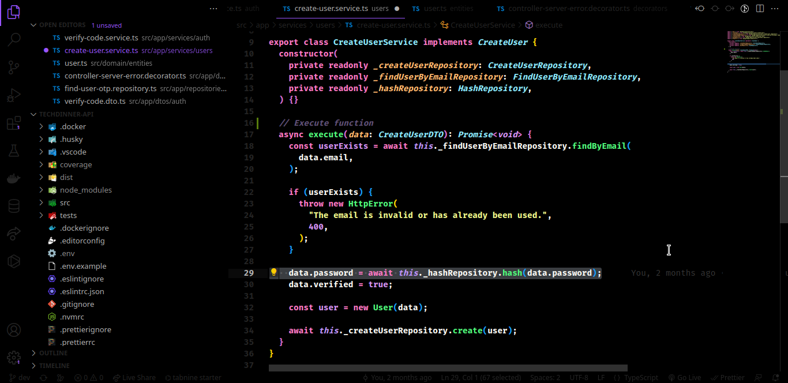

  

<h1 align="center">Hallucination Theme</h1>

  Dark theme for Visual Studio Code.

  

(Hallucination Dark)

  

(Hallucination Full Dark)

## Installing

#### Install using Command Palette

1.  Go to `View -> Command Palette` or press `Ctrl+Shift+P`;
2.  Then enter `Install Extension`;
3.  Write `Hallucination`;
4.  Select it or press `Enter` to install.

#### Activating theme

Run Visual Studio Code. The Hallucination theme will be available from `File -> Preferences -> Color Theme` dropdown menu.

## How to contribute

Read our [contribution](/CONTRIBUTING.md) guide.

## Contributors

## Authors

| [ @matheusdearaujo](https://github.com/matheusdearaujo)  | [ @philipecerqueira](https://github.com/matheusdearaujo)  |
|:-:|:-:|

## LICENSE

This repository use [MIT License](/LICENSE).
